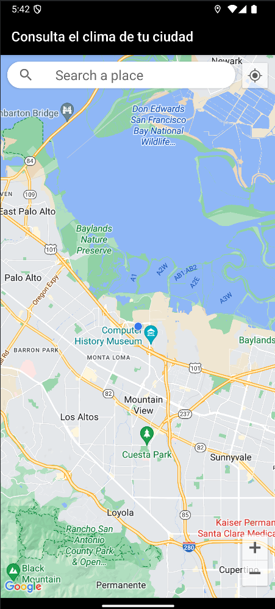
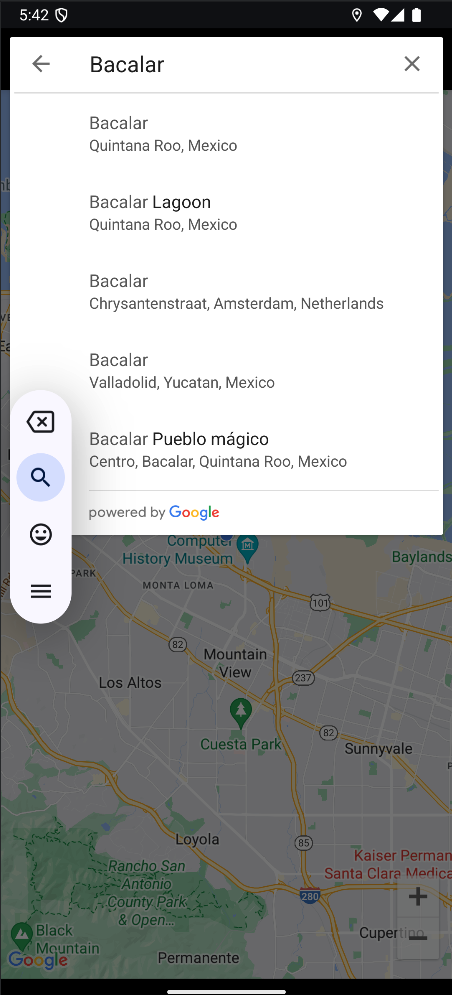
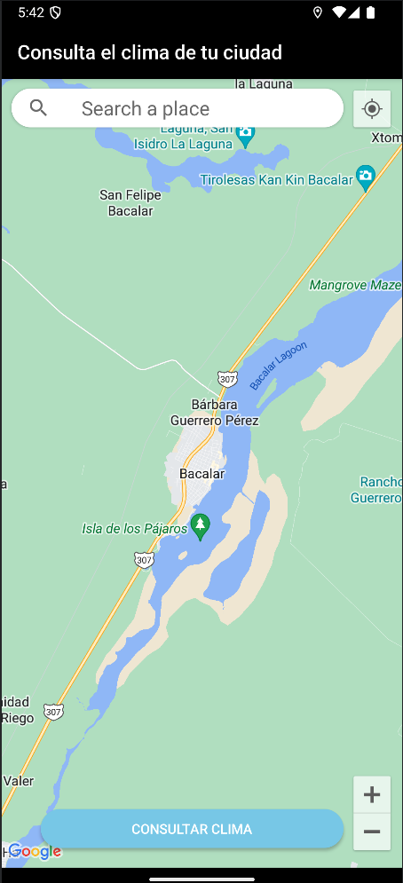

# OpenWeatherApp
Aplicación para consultar el clima en tiempo real en cualquier parte del mundo.

## Características
- Búsqueda de ciudades.
- Actualización de datos meteorológicos (grados celsius, % humedad) en tiempo real.

## Tecnologías utilizadas
- **Kotlin**
- **MVVM**: Patrón de arquitectura.
- **Retrofit**: API para datos meteorológicos.
- **Coroutines**: Manejo de concurrencia.
- **LiveData**: Observables para actualizar UI.
- **Dagger/Hilt**: Inyección de dependencias.
- **Room**: Guardar y consultar información meteórologica offline.

## Pasos para descargar e instalar el proyecto
1. Clonar el repositorio:
   git clone [https://github.com/username/WeatherApp.git](https://github.com/Danimedina25/OpenWeatherApp.git)
2. Crear una cuenta en OpenWeatherMap (https://openweathermap.org/api) para obtener la API key.
3. Añadir la API key en el archivo 'com.example.openweatherapp.openWeatherFeature.domain.util.Constants'.
open_weather_api_key = "tu_api_key"

## Capturas de pantalla
   ### Ícono launcher
   
   
   ### Pantalla principal
   
   
   ### Pantalla de búsqueda de ciudades
   

   ### Pantalla de ciudad encontrada
   

   ### Pantalla de datos meteorológicos
   
